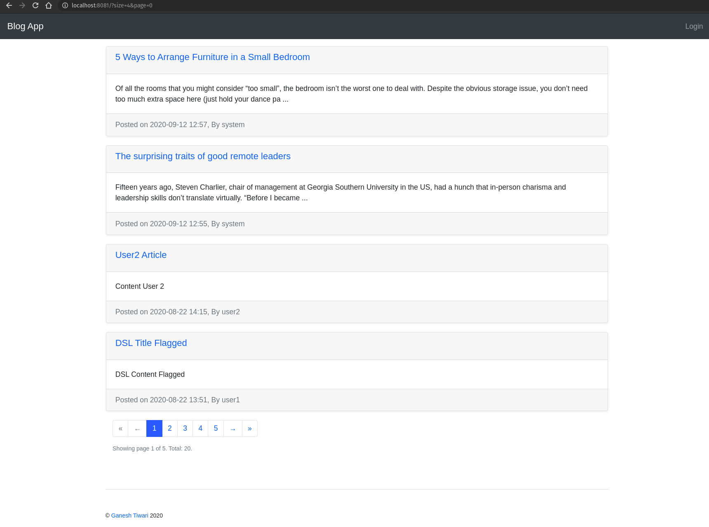
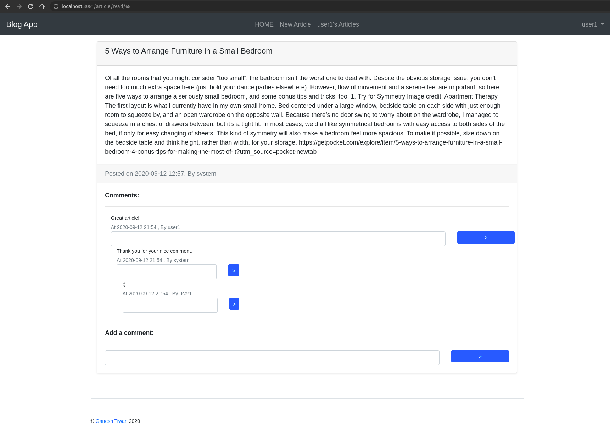
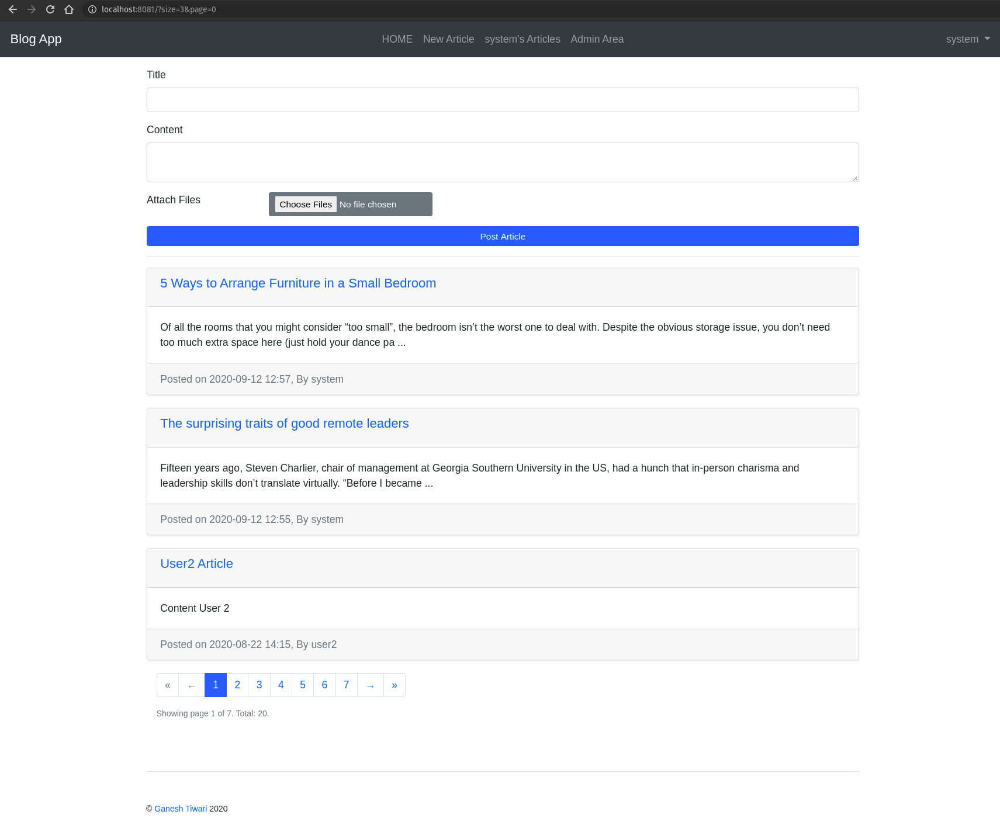
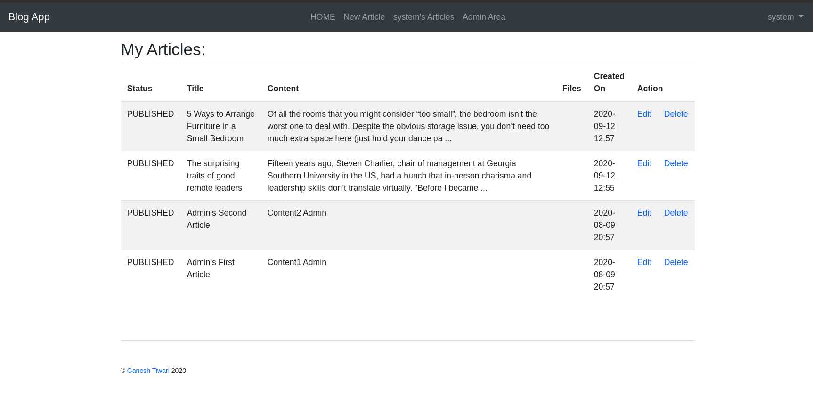
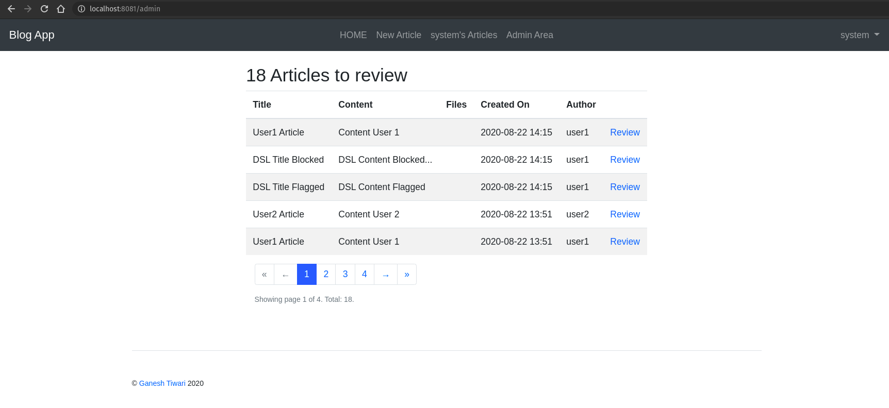
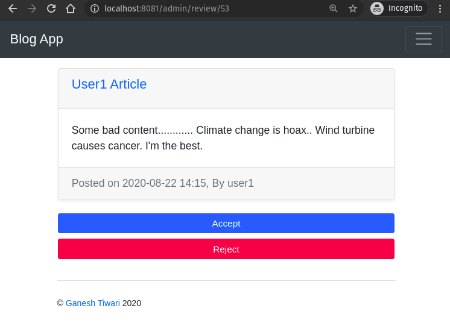
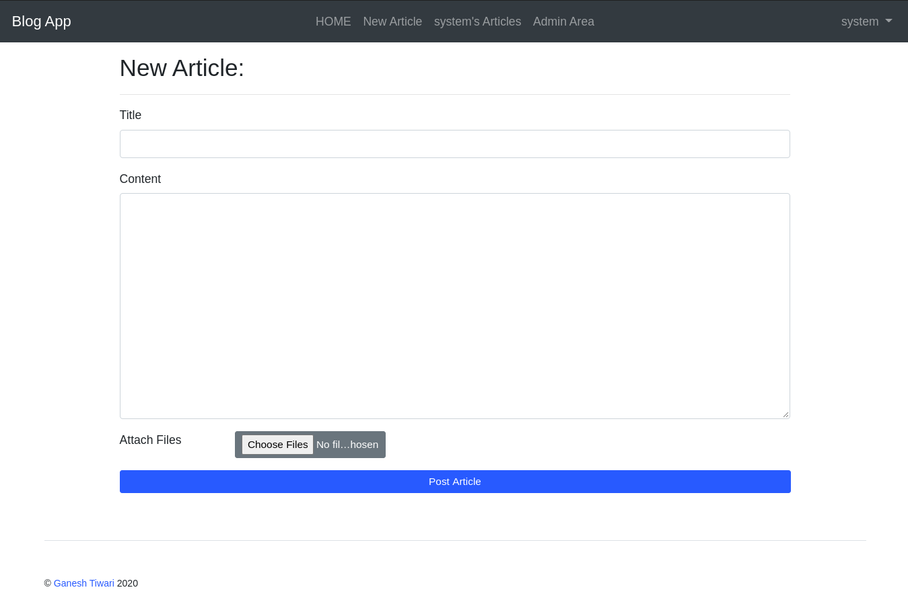

### A Spring Boot Web Application Seed with tons of Ready to use features. Can be used as starter for bigger projects.

#### Variations
- Version without KeyCloak is on 'without-keycloak' branch https://github.com/gtiwari333/spring-boot-web-application-seed/tree/without-keycloak
- Simpler version without KeyCloak and multi-modules is on separate project https://github.com/gtiwari333/spring-boot-blog-app

#### Included Features/Samples

App Architecture:
- Multi-module Maven app
- Modular Service/Repository components
- Default test data created while running the app
- Spring / Maven profiles for dev/prod/docker ...
- Dockerfile to run images
- Docker maven plugin to publish images (follow docker-steps.md)
- TestContainer in both runtime(optional) and test
- Deploy to Amazon EC2 ( follow docker-steps.md )

MicroService:
- Spring Sleuth based tracing
- Exposing and implementing Open Feign clients
- Spring Cloud Contract

Spring MVC:
- Public and internal pages
- MVC with thymeleaf templating
- Live update of thymeleaf templates for local development
- HTML fragments, reusable pagination component using Thymeleaf parameterized fragments
- webjar - bootstrap4 + jquery
- Custom Error page
- Request logger filter
- Swagger API Docs with UI  ( http://localhost:8081/swagger-ui.html)
- @RestControllerAdvice, @ControllerAdvice demo
- CRUD UI + File upload/download
- favicon handler

Security:
- Account management with KeyCloak
- Spring Security 
- User/User_Authority entity and repository/services
    - login, logout, home pages based on user role
- Domain object Access security check on update/delete using custom PermissionEvaluator
- private pages based on user roles
- public home page -- view all notes by all 
- Limit max number of record in a paged request

Persistence/Search:
- Data JPA with User/Authority/Note/ReceivedFile entities, example of EntityGraph
- MySQL or any other SQL db can be configured for prod/docker etc profiles
- (in old code) H2 db for local, Console enabled for local ( http://localhost:8081/h2-console/, db url: jdbc:h2:mem:testdb, username: sa)
- jOOQ integration with code generation based on JPA entity 
- Liquibase database migration

Test:
- Unit/integration with JUnit 5, Mockito and Spring Test
- e2e with Selenide, fixtures. default data generated using Spring
- file upload/download e2e test with Selenide
- Architecture test using ArchUnit
- TestContainers to perform realistic integration test
- Tests with Spock Framework (Groovy 3, Spock 2)
- Load test with Gatling

Misc:
- Code Generation: lombok,  mapstruct 
- Message Queue using ActiveMQ Artemis
- approval/flagging api - message based
- Nested comment

Future: do more stuff
- Spring Cloud Contract integration (WIP)
- Search service using elastic search -- search into uploaded files as well (WIP)
- Docker-compose deploy/kubernetes 
- Caching impl
- Geo-Spatial query for visitors
- Grafana Dashboard, @Timed and more ...
- logback LevelChangePropagator integration
- logback error email
- logback rolling policy
- Example of background jobs with Quartz with a basic API/UI
- Integrate Markdown editor for writing notes
- rate limit by IP on public API ( article api )
- Fetch user's avatar
- UI improvement
- S3 file upload, test with localstack TestContainers
- nested comment query/performance fix 
- Signup UI
- vendor neutral security with OIDC

 
### Requirements
- JDK 11+
- Lombok configured on IDE
    - http://ganeshtiwaridotcomdotnp.blogspot.com/2016/03/configuring-lombok-on-intellij.html
    - For eclipse, download the lombok jar, run it, and point to eclipse installation
- Maven
- Docker

#### How to Run

It contains following applications:

- main-app
- email-service (optional)
- report-service (optional)
- trend-service (optional)
- profanity-checker (optional)

Option 1 - run with manually started KeyCloak and ActiveMQ servers
- Run ```mvn clean install``` at root 
- Run ```docker-compose -f _config/docker-compose.yml up``` at root to start docker containers
- Go to main-app folder and run ```mvn``` to start the application

Option 2 - automatically start KeyCloak and ActiveMQ using TestContainer while application is starting
- Run ```mvn clean install``` at root 
- Go to main-app folder and run ```mvn -Pdev,withTestContainer``` to start the application

Option 3 - run from IDE
- import into your IDE and compile the full project and run the Application.java on main-app module
- Update run configuration to run maven goal `wro4j:run` Before Launch. It should be after 'Build'


Once the application starts, open  `http://localhost:8081` on your browser. The default username/passwords are listed on : gt.app.Application.initData, which are:

- system/pass
- user1/pass
- user2/pass


#### Screenshots:

#### Public View


#### Read Article with nested comment/discussion


#### Logged in Feed View


#### Logged in User's Article List View


#### Admin User's Review Page to approve/disapprove flagged posts


#### Review Page


#### New Article



#### Dependency/plugin version checker
 - `mvn versions:display-dependency-updates`
 - `mvn versions:display-plugin-updates`
