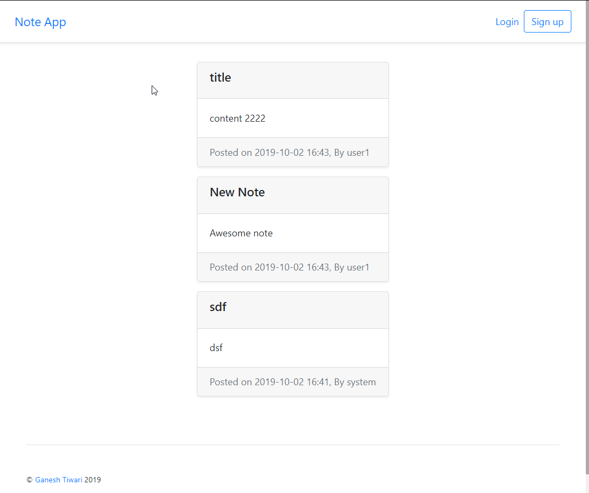
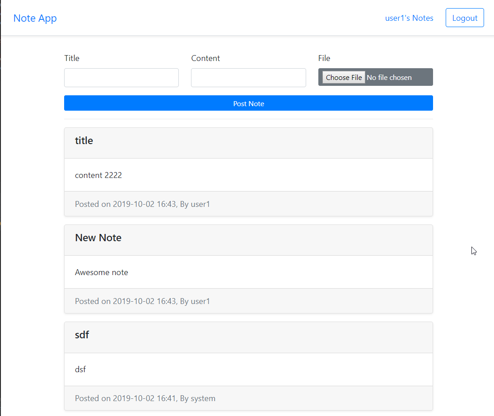
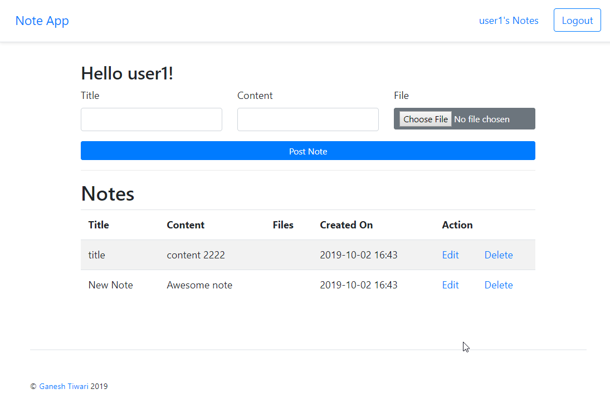

# A Spring Boot Web Application Seed with tons of Ready to use features

### Intro
This is a simple micro blogging application where you can post a note/blog and other can view it.

The default username/passwords are listed on : gt.app.Application.initData, which are:

- system/pass
- user1/pass
- user2/pass

### Requirements
- JDK 11+
- Lombok configured on IDE
    - http://ganeshtiwaridotcomdotnp.blogspot.com/2016/03/configuring-lombok-on-intellij.html
    - For eclipse, download the lombok jar, run it, and point to eclipse installation
- Maven (optional)

### How to Run
- Clone/Download and Import project into your IDE, compile and run Application.java 

OR

- mvnw compile spring-boot:run   //if you don't have maven installed in your PC

OR

- mvn compile spring-boot:run //if you have maven  installed in your PC

And open   `http://localhost:8080` on your browser

### Included Features/Samples
- Modular application
- Data JPA with User/Authority/Note/ReceivedFile entities, example of EntityGraph
- Default test data created while running the app
- Public and internal pages
- MVC with thymeleaf templating
- File upload/download
- Live update of thymeleaf templates for local development
- HTML fragments
- webjar - bootstrap4 + jquery
- Custom Error page
- Request logger filter
- Swagger API Docs with UI  ( http://localhost:8080/swagger-ui.html)
- @RestControllerAdvice, @ControllerAdvice demo
- CRUD Note + File upload
- Spring / Maven profiles for dev/prod/docker ...
- Dockerfile to run images
- Docker maven plugin to publish images (follow docker-steps.md)
- Deploy to Amazon EC2 ( follow docker-steps.md )
- Code Generation: lombok,  mapstruct 
- H2 db for local, Console enabled for local ( http://localhost:8080/h2-console/, db url: jdbc:h2:mem:testdb, username: sa)
- MySQL or any other SQL db can be configured for prod/docker etc profiles
- User/User_Authority entity and repository/services
    - login, logout, home pages based on user role
- Security with basic config
- Domain object Access security check on update/delete using custom PermissionEvaluator
- public home page -- view all notes by all 
- private pages based on user roles
- Test cases - unit/integration with JUnit 5, Mockito and Spring Test
- e2e with Selenide, fixtures. default data generated using Spring
- Architecture test using ArchUnit

Future: do more stuff
- Account management with KeyCloak
- Email
- background jobs with Quartz
- Liquibase/Flyway change log
- Integrate Markdown editor for writing notes
- search service using elastic search -- search into uploaded files as well
- rate limit by IP on public API ( note api )

## Screenshots:

#### Public View

#### Logged in Feed View

#### Logged in List View

